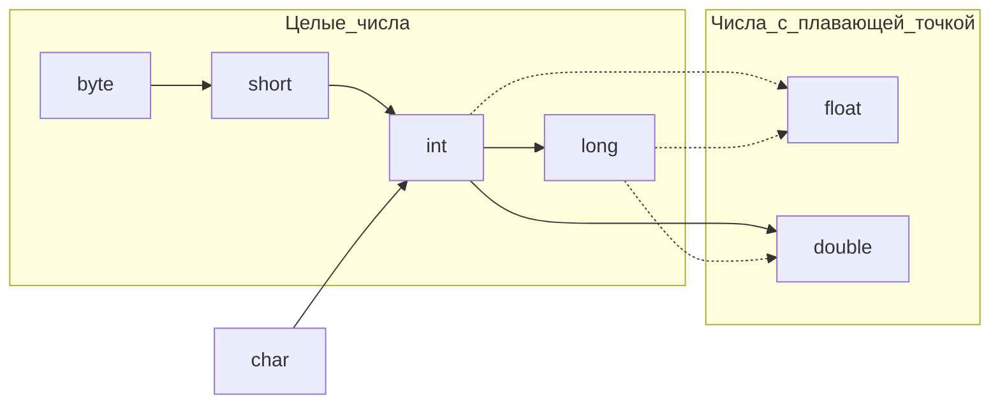

# 3.5. Операции
### Определение операций
Операции служат для объединения значений. Как будет показано в последующих разделах, в Java предоставляется богатый набор арифметических и логических операций и математических функций.
## 3.5.1. Арифметические операции
### Арифметические операции сложения, вычитания, умножения и деления
Для обозначения арифметических операций сложения, вычитания, умножения и деления в Java употребляются обычные знаки подобных операций: `+ - * /` соответственно. Операция `/` обозначает целочисленное деление, если оба ее аргумента являются целыми числами. В противном случае эта операция обозначает деление чисел с плавающей точкой.
### Остаток от деления целых чисел
Остаток от деления целых чисел обозначается символом `%`. Например, `15 / 2` равно `7`, `15 % 2` равно `1`, а `15.0/2` - `7.5`.
### Деление на нуль целых чисел и чисел с плавающей точкой
Следует, однако, иметь в виду, что в результате целочисленного деления на нуль генерируется исключение, в то время как результатом деления на нуль чисел с плавающей точкой является бесконечность или **NaN**.
### Задача переносимости вычислений операций на разных машинах
Одной из заявленных целей языка Java является переносимость. Вычисления должны приводить к одинаковому результату, независимо от того, какая виртуальная машина их выполняет. Для арифметических операций над числами с плавающей точкой соблюдение этого требования неожиданно оказалось непростой задачей. Для хранения числовых значений типа ***double*** используются 64 бита, но в некоторых процессорах применяются 80-разрядные регистры с плавающей точкой. Эти регистры обеспечивают дополнительную точность на промежуточных стадиях вычисления. Подобным образом можно повысить точность вычислений, избежав переполнения. Но этот результат может оказаться иным, если в ходе всех вычислений используется 64-разрядный процессор.
### Выбор между повышенной точностью и воспроизводимостью результатов в **Java**
По умолчанию при промежуточных вычислениях в виртуальной машине может использоваться повышенная точность. Но в методах, помеченных ключевым словом ***strictfp***, должны применяться точные операции над числами с плавающей точкой, гарантирующие воспроизводимость результатов. Например, метод *main()* можно объявить так:
```java
public static strictfp void main(String[] args)
```
В этом случае все команды в теле метода *main()* будут выполнять точные операции над числами с плавающей точкой. А если пометить ключевым словом ***strictfp*** класс, то во всех его методах должны выполняться точные операции с плавающей точкой.
## 3.5.2. Математические функции и константы
### Описание класса **Math**
В состав класса **Math** входит целый набор математических функций, которые нередко требуются для решения практических задач.
### Извлечение квадратного корня
В частности, чтобы извлечь квадратный корень из числа, применяется метод *sqrt()*:
```java
double х = 4;
double у = Math.sqrt(x);
System.out.println(y); //выводит числовое значение 2.0
```
### Возведение в степень
В языке Java не поддерживается операция возведения в степень. Для этой цели следует вызвать метод *pow()* из класса **Math**. В результате выполнения приведенной ниже строки кода переменной у присваивается значение переменной x, возведенное в степень a (x<sup>a</sup>). Оба параметра метода *pow()*, а также возвращаемое им значение относятся к типу ***double***.
```java
double у = Math.pow(x,a);
```
### Тригонометрические функции
В состав класса **Math** входят также перечисленные ниже методы для вычисления обычных тригонометрических функций.
```java
Math.sin()
Math.cos()
Math.tan()
Math.atan()
Math.atan2()
```
### Экспонента и логарифмы
Кроме того, в него включены методы для вычисления экспоненциальной и обратной к ней логарифмической функции (натурального и десятичного логарифмов):
```java
Math.exp()
Math.log()
Math.log10()
```
### Константы `π` и `e`
И, наконец, в данном классе определены также следующие две константы как приближенное представление чисел `π` и `e`.
```java
Math.PI
Math.E
```
### Класс **StrictMath** для предсказуемости результатов операций с числами
Для повышения производительности методов из класса **Math** применяются процедуры из аппаратного модуля, выполняющего операции с плавающей точкой. Если для вас важнее не быстродействие, а предсказуемые результаты, пользуйтесь классом **StrictMath**. В нем реализуются алгоритмы из свободно распространяемой библиотеки **fdlibm** математических функций (www.netlib.org/fdlibm), гарантирующей идентичность результатов на всех платформах.
### Переполнение при операциях с целыми числами
В классе **Math** предоставляется ряд методов, обеспечивающих более надежное выполнение арифметических операций. Математические операции негласно возвращают неверные результаты, когда вычисление приводит к переполнению. Например, результат умножения одного миллиарда на три `(1000000000 * 3)` оказывается равным `-1294967296`, поскольку максимальное значение типа ***int*** лишь ненамного превышает два миллиарда.
### Перехват переполнений при операциях с целыми числами
А если вместо этого вызвать метод *Math.multiplyExact(1000000000, 3)*, то будет сгенерировано исключение. Это исключение можно перехватить, чтобы нормально завершить выполнение программы, а не позволить ей продолжаться негласно с неверным результатом умножения. В классе **Math** имеются также методы *addExact()*, *subtractExact()*, *incrementExact()*, *decrementExact()*, *negateExact()* с параметрами типа ***int*** и ***long***.
## 3.5.3. Преобразование числовых типов
### Допустимые преобразования числовых типов
Нередко возникает потребность преобразовать один числовой тип в другой. На рис. представлены допустимые преобразования числовых типов.
Допустимые преобразования числовых типов:

Шесть {пять} сплошных линий со стрелками на рисунке обозначают преобразования, которые выполняются без потери данных, а три штриховые линии со стрелками - преобразования, при которых может произойти потеря точности.
### Преобразование числовых типов при операциях с двумя числами
Если два числовых значения объединяются бинарной операцией то перед выполнением операции оба операнда преобразуются в числовые значения одинакового типа по следующим правилам.
* Если хотя бы один из операндов относится к типу ***double***, то и второй операнд преобразуется в тип ***double***.
* Иначе, если хотя бы один из операндов относится к типу ***float***, то и второй операнд преобразуется в тип ***float***.
* Иначе, если хотя бы один из операндов относится к типу ***long***, то и второй операнд преобразуется в тип ***long***.
* Иначе оба операнда преобразуются в тип ***int***.
## 3.5.4. Приведение типов
### Преобразование числовых типов с возможной потерей данных
Преобразования числовых типов в Java возможны, но они могут, конечно, сопровождаться потерей данных. Такие преобразования называются *приведением типов*. Синтаксически приведение типов задается парой скобок, в которых указывается желательный тип, а затем имя переменной:
```java
double x = 9.997;
int nx = (int)x;
```
В результате приведения к целому типу числового значения с плавающей точкой, хранящегося в переменной `x`, значение переменной `nx` становится равным `9`, поскольку дробная часть числа при этом отбрасывается.
### Округление числа с плавающей точкой до ближайшего целого числа
Если же требуется округлить число с плавающей точкой до ближайшего целого числа (что во многих случаях намного полезнее), то для этой цели служит метод *Math.round()*, как показано ниже.
```java
double x = 9.997;
int nx = (int)Math.round(x);
```
### Усечение при приведении типов
При попытке приведения типов результат может выйти за пределы диапазона допустимых значений. И в этом случае произойдет усечение. Например, при вычислении выражения `(byte)300` получается значение `44`.
## 3.5.5. Сочетание арифметических операций с присваиванием
В языке Java предусмотрена сокращенная запись бинарных арифметических операций (т.е. операций, предполагающих два операнда). Например, следующая строка кода:
```java
x += 4;
```
равнозначна такой строке кода:
```java
x = x + 4;
```
(В сокращенной записи знак арифметической операции, например `*` или `%`, размещается перед знаком равенства, например `*=` или `%=`.)
## 3.5.6. Операции инкремента и декремента
### Постфиксная форма
Одной из самых распространенных операций с числовыми переменными является добавление или вычитание единицы. В языке Java для этой цели предусмотрены операции инкремента и декремента. Так, в результате операции `n++` к текущему значению переменной `n` прибавляется единица, а в результате операции `n--` значение переменной `n` уменьшается на единицу. Операции `++` и `--` изменяют значение переменной, поэтому их нельзя применять к самим числам. Например, выражение `4++` считается недопустимым.
### Префиксная форма
Существуют два вида операций инкремента и декремента. Выше продемонстрирована постфиксная форма, в которой символы операции размещаются после операнда. Но есть и префиксная форма: `++n`.
### Разница префиксной и постфиксной форм
Обе эти операции изменяют значение переменной на единицу. Их отличие проявляется только тогда, когда эти операции присутствуют в выражениях. В префиксной форме сначала изменяется значение переменной, и для дальнейших вычислений уже используется новое значение, а в постфиксной форме используется прежнее значение этой переменной, и лишь после данной операции оно изменяется.
### Использование операций инкремента и декремента в выражениях
Пользоваться операциями инкремента и декремента в выражениях не рекомендуется, поскольку это зачастую запутывает код и приводит к досадным ошибкам.
## 3.5.7. Операции отношения и логические операции
В состав Java входит полный набор операций отношения.
### Операции проверки равенства и неравенства
Для проверки на равенство служат знаки `==`. Например, выражение `3 == 7` дает в результате логическое значение ***false***. Для проверки на неравенство служат знаки `!=`. Так, выражение `3 != 7` дает в итоге логическое значение ***true***.
### Операции сравнения
Кроме того, в Java поддерживаются обычные операции сравнения: `<` (меньше), `>`(больше), `<=` (меньше или равно) и `=>` (больше или равно).
### Логические операции `И` и `ИЛИ`
В языке Java, знаки `&&` служат для обозначения логической операции `И`, а знаки `||` - для обозначения логической операции `ИЛИ`. Как обычно, знак восклицания (`!`) означает логическую операцию отрицания. Операции `&&` и `||` задают порядок вычисления по сокращенной схеме: если первый операнд определяет значение всего выражения, то остальные операнды не вычисляются.
### Тернарная операция (оператор Элвиса)
В языке Java имеется также тернарная операция `?:`, которая иногда оказывается полезной. Ниже приведена ее общая форма.
```java
условие ? выражение 1 : выражение_2
```
Если условие истинно, то вычисляется первое выражение, а если оно ложно второе выражение. Например, вычисление выражения `x < y ? x : y` дает в итоге меньшее из значений переменных `x` и `y`.
## 3.5.8. Поразрядные логические операции
Работая с любыми целочисленными типами данных, можно применять операции, непосредственно обрабатывающие двоичные разряды, или биты, из которых состоят целые числа. Это означает, что для определения состояния отдельных битов числа можно использовать маски. В языке Java имеются следующие поразрядные операции: `&` (И), `|` (ИЛИ), `^` (исключающее ИЛИ), `~` (НЕ).
### Примеры применения маски к битам числа
Так, если `n` - целое число, то приведенное ниже выражение будет равно единице только в том случае, если четвертый бит в двоичном представлении числа равен единице.
```java
int fourthBitFromRight = (n & 8) / 8;
```
Используя поразрядную операцию `&` в сочетании с соответствующей степенью 2, можно замаскировать все биты, кроме одного.
```java
int[] array = {1,2,3,4,5,6,7,8,9,10};
for(int i: array)
	System.out.println(Integer.toBinaryString(i) + " - " + Integer.toBinaryString(i&0b11));
/* Вывод консоли:
1 - 1
10 - 10
11 - 11
100 - 0
101 - 1
110 - 10
111 - 11
1000 - 0
1001 - 1
1010 - 10
*/
```
### Разница между логичискими операциями `&, |` и `&&, ||`
При выполнении поразрядной операции `&` и `|` над логическими переменными типа ***boolean*** получаются логические значения. Эти операции аналогичны логическим операциям `&&` и `||`, за исключением того, что вычисление производится по полной схеме, т.е. обрабатываются все элементы выражения.
### Логические операции сдвига
В языке Java поддерживаются также операции `>>` и `<<`, сдвигающие двоичное представление числа вправо или влево.
### Пример поразрядного маскирования
Эти операции удобны в тех случаях, если требуется сформировать двоичное представление для поразрядного маскирования:
```java
int fourthBitFromRight = (n & (1 << 3)) >> 3;
```
### Сокращение по модулю при операции поразрядного сдвига
Значение в правой части операций поразрядного сдвига сокращается по модулю 32 (если левая часть является целочисленным значением типа ***long***, то правая часть сокращается по модулю 64). Например, выражение `1<<35` равнозначно выражению `1<<3` и дает в итоге значение 8.
### Сокращение по модулю при операции поразрядного сдвига (stackovergo)
Во многих языках программирования смещение, превышающее размер числового типа данных (32 бита для ***int***, 64 бита для ***long***), не определено. С другой стороны, Java определяет это так, что запись `n << d` эквивалентна `n << (d % 32)` в котором n типа ***int***, а запись `n << d` эквивалентна `n << (d % 64)` в котором n типа ***long***. Итак, `1 << 35` эквивалентна `1 << (35 % 32)`, т.е. `1 << 3 = 8`.
https://stackovergo.com/ru/q/2343974/what-is-reduced-modulo-32-or-64
### Мои примеры операций сдвига
{Операция сдвига намного проще в вычислении, чем операция умножения на 2^n. По аналогии умножение на 10 намного проще, чем на другие числа}
```java
System.out.println(16 >> 3); // Консоль: "2": 16/2^3 или 16/8 или 0b10000 -> 0b00010==2
System.out.println(0b11 << 2); // Консоль: "12": 3*2^2 или 3*4 или 0b0011 -> ob1100
System.out.println(15 >> 3); // Консоль: "1": 15/2^3 или 15/8 или 0b111 -> ob001
```

```java
for(int i = 0; i < 32; i++) System.out.print((i & (1 << 3)) >> 3);
// Вывод консоли: "00000000111111110000000011111111"
// т.е. по сути это операция маскирования 4-го разряда числа в двоичной форме
```
## 3.5.9. Круглые скобки и иерархия операций
В таблице представлены сведения о предшествовании, или приоритетности, операций. Если скобки не используются, то сначала выполняются более приоритетные операции. Операции, находящиеся на одном уровне иерархии, выполняются слева направо, за исключением операций, имеющих правую ассоциативность, как показано в таблице. Например, операция `&&` приоритетнее операции `||`, поэтому выражение `a && b || c` равнозначно выражению `(a && b) || c`. Операция `+=` ассоциируется справа налево, а следовательно, выражение `a += b += c` означает `a += (b += c)`. В данном случае значение выражения `b += c` (т.е. значение переменной b после прибавления к нему значения переменной c) прибавляется к значению переменной a.
Таблица. Приоритетность операций

Операции | Ассоциативность
--- | ---
`[ ] . () (вызов метода)` | Слева направо
`! ~ ++ -- + (унарная) - (унарная) () (приведение) new` | Справа налево
`* / %` | Слева направо
`+ -` | Слева направо
`<< >> >>>` | Слева направо
`< <= > >=` instanceof | Слева направо
`== !=` | Слева направо
`&` | Слева направо
`^` | Слева направо
\| | Слева направо
`&&` | Слева направо
\|\| | Слева направо
`?:` | Справа налево
`= += -= *= /= %= \|= ^= <<= >>= >>>=` | Справа налево
